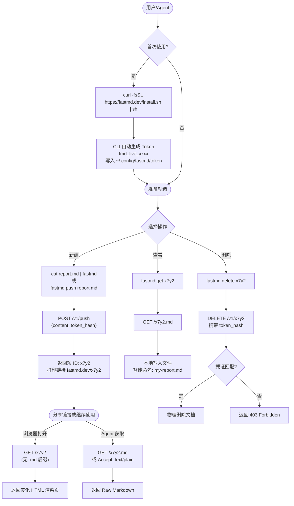

# fastmd.dev 技术规格文档

## 一、用户流程图

### 主流程：终端发起的完整生命周期



---

## 二、功能清单 (Feature List)

### 后端 API

| 端点 | 方法 | 功能 | 认证 |
|---|---|---|---|
| `/v1/push` | POST | 创建文档，返回短 ID | Token（写入 body） |
| `/:id` | GET | 浏览器访问返回 HTML | 无 |
| `/:id.md` | GET | 返回 Raw Markdown | 无 |
| `/v1/:id` | DELETE | 物理删除文档 | Token Hash 校验 |
| `/v1/version` | GET | 返回最新 CLI 版本号 | 无 |

**请求/响应约定：**

```
POST /v1/push
Body: { "content": "# Hello\n...", "token": "fmd_live_xxxx" }
Response: { "id": "x7y2", "url": "https://fastmd.dev/x7y2" }

DELETE /v1/x7y2
Header: Authorization: Bearer fmd_live_xxxx
Response: { "ok": true }

GET /v1/version
Response: { "version": "0.1.2", "install_url": "https://fastmd.dev/install.sh" }
```

### CLI 命令

| 命令 | 描述 |
|---|---|
| `cat file.md \| fastmd` | 管道推送，创建文档 |
| `fastmd push <file>` | 推送本地文件 |
| `fastmd get <ID>` | 拉取云端文档到本地（智能命名） |
| `fastmd delete <ID>` | 删除指定文档 |
| `fastmd upgrade` | 自我升级 |

### 网站页面 (Web Pages)

| 路由 | 页面 | 说明 |
|---|---|---|
| `GET /` | **首页** | 产品介绍 + 一键安装命令 + 核心使用场景演示 |
| `GET /docs` | **文档页** | 完整 API 参考 + CLI 使用说明 + 示例 |
| `GET /help` | **帮助页** | 常见问题（Token 丢失怎么办？内容大小限制？） |
| `GET /:id` | **文档渲染页** | 美化 HTML 渲染，供人类审阅 |
| `GET /404` | **404 页** | 文档不存在或已过期的友好提示 |

**首页重点内容：**
- Hero：一句话定位 + `curl` 安装命令（可一键复制）
- 使用演示：终端动效 GIF 或代码块展示 `cat file.md | fastmd` → 输出链接的过程
- 三大场景卡片：AI Agent 集成 / 开发者分享 / 快速预览
- 底部：GitHub 链接 + 开源声明

---

## 三、任务拆分 (Task Breakdown)

### T1：项目初始化
- [ ] 初始化 Go 模块 (`go mod init fastmd`)
- [ ] 安装依赖：Echo, go-sqlite3 (纯Go驱动: `modernc.org/sqlite`)
- [ ] 创建目录结构：`cmd/server/`, `cmd/cli/`, `internal/store/`

### T2：数据库层 (SQLite)
- [ ] 设计并创建 Schema（见第四节）
- [ ] 实现 `store.go`：Create / GetByID / DeleteByID 方法
- [ ] Token 哈希校验逻辑

### T3：后端 API (`server.go`)
- [ ] `POST /v1/push` — 创建文档
- [ ] `GET /:id` — 双面路由（浏览器 HTML / `.md` Raw）
- [ ] `DELETE /v1/:id` — 删除文档（Token 校验）
- [ ] `GET /v1/version` — 版本查询
- [ ] Markdown → HTML 渲染（使用 `goldmark` 库）
- [ ] 短 ID 生成（NanoID 或自定义 Base62）

### T3.5：网站页面 (`web/`)
- [ ] **首页** `/` — Hero + 安装命令复制 + 场景卡片 + GitHub 链接
- [ ] **文档页** `/docs` — API 参考 + CLI 完整说明 + 代码示例
- [ ] **帮助页** `/help` — Token 丢失、内容限制、API 限流等 FAQ
- [ ] **404 页** — 文档不存在/已过期的友好提示
- [ ] 文档渲染页美化（代码高亮、字体、响应式）
- [ ] 页面模板统一（Header/Footer/导航）

### T4：CLI 工具 (`cli.go`)
- [ ] 首次启动自动生成 Token，写入 `~/.config/fastmd/token`
- [ ] `push` 子命令（含管道检测）
- [ ] `get` 子命令（含智能文件命名）
- [ ] `delete` 子命令
- [ ] `upgrade` 子命令
- [ ] 错误处理与友好输出

### T5：部署与运维
- [ ] 编写 `install.sh` 安装脚本
- [ ] Systemd unit 文件
- [ ] Caddy 配置（反代 + 自动 HTTPS）
- [ ] `/v1/version` 版本号由构建时注入 (`ldflags`)

---

## 四、SQLite 技术方案

### 驱动选择

使用 **`modernc.org/sqlite`**（纯 Go 实现，无 CGO 依赖），方便交叉编译和部署。

```bash
go get modernc.org/sqlite
```

### Schema 设计

```sql
CREATE TABLE IF NOT EXISTS documents (
    id          TEXT PRIMARY KEY,        -- 短 ID，如 "x7y2"（Base62, 4位）
    content     TEXT NOT NULL,           -- 原始 Markdown 内容
    token_hash  TEXT NOT NULL,           -- SHA-256(token)，用于所属权校验
    ip_hash     TEXT,                    -- SHA-256(IP)，可选，用于滥用防范
    created_at  INTEGER NOT NULL,        -- Unix timestamp
    expires_at  INTEGER DEFAULT NULL     -- NULL = 永久；TTL 功能预留字段
);

CREATE INDEX IF NOT EXISTS idx_token_hash ON documents(token_hash);
CREATE INDEX IF NOT EXISTS idx_expires_at ON documents(expires_at);
```

### 核心操作实现

#### 初始化

```go
// internal/store/store.go
package store

import (
    "database/sql"
    _ "modernc.org/sqlite"
)

type Store struct { db *sql.DB }

func New(path string) (*Store, error) {
    db, err := sql.Open("sqlite", path+"?_journal=WAL&_timeout=5000")
    if err != nil { return nil, err }
    db.SetMaxOpenConns(1) // SQLite 写操作串行化
    if err := migrate(db); err != nil { return nil, err }
    return &Store{db: db}, nil
}

func migrate(db *sql.DB) error {
    _, err := db.Exec(`CREATE TABLE IF NOT EXISTS documents (
        id         TEXT PRIMARY KEY,
        content    TEXT NOT NULL,
        token_hash TEXT NOT NULL,
        ip_hash    TEXT,
        created_at INTEGER NOT NULL,
        expires_at INTEGER DEFAULT NULL
    );
    CREATE INDEX IF NOT EXISTS idx_token_hash ON documents(token_hash);
    CREATE INDEX IF NOT EXISTS idx_expires_at ON documents(expires_at);`)
    return err
}
```

#### 创建文档

```go
func (s *Store) Create(id, content, tokenHash, ipHash string) error {
    _, err := s.db.Exec(
        `INSERT INTO documents (id, content, token_hash, ip_hash, created_at)
         VALUES (?, ?, ?, ?, ?)`,
        id, content, tokenHash, ipHash, time.Now().Unix(),
    )
    return err
}
```

#### 查询文档

```go
type Document struct {
    ID        string
    Content   string
    TokenHash string
    CreatedAt int64
    ExpiresAt *int64
}

func (s *Store) GetByID(id string) (*Document, error) {
    row := s.db.QueryRow(
        `SELECT id, content, token_hash, created_at, expires_at
         FROM documents WHERE id = ?
         AND (expires_at IS NULL OR expires_at > ?)`,
        id, time.Now().Unix(),
    )
    var doc Document
    err := row.Scan(&doc.ID, &doc.Content, &doc.TokenHash,
                    &doc.CreatedAt, &doc.ExpiresAt)
    if err == sql.ErrNoRows { return nil, nil }
    return &doc, err
}
```

#### 删除文档（带 Token 校验）

```go
func (s *Store) Delete(id, tokenHash string) (bool, error) {
    res, err := s.db.Exec(
        `DELETE FROM documents WHERE id = ? AND token_hash = ?`,
        id, tokenHash,
    )
    if err != nil { return false, err }
    n, _ := res.RowsAffected()
    return n > 0, nil // false = ID 不存在或 Token 不匹配
}
```

### 短 ID 生成策略

```go
const alphabet = "0123456789abcdefghijklmnopqrstuvwxyzABCDEFGHIJKLMNOPQRSTUVWXYZ"

func generateID(length int) string {
    b := make([]byte, length)
    rand.Read(b)
    for i, v := range b {
        b[i] = alphabet[v%byte(len(alphabet))]
    }
    return string(b)
}
// 4位 Base62 = 62^4 ≈ 1480万种组合，MVP 阶段足够
// 冲突检测：Insert 失败时重试（概率极低）
```

### WAL 模式说明

连接字符串加 `?_journal=WAL` 开启 WAL 模式：
- **并发读**不阻塞写，适合读多写少的文档分享场景
- 写操作通过 `SetMaxOpenConns(1)` 串行化，避免 SQLite 写锁争用

---

## 五、目录结构

```
fastmd/
├── cmd/
│   ├── server/
│   │   └── main.go        # 后端入口
│   └── cli/
│       └── main.go        # CLI 入口
├── internal/
│   ├── store/
│   │   └── store.go       # SQLite 数据层
│   └── render/
│       └── render.go      # Markdown → HTML (goldmark)
├── web/
│   ├── templates/
│   │   ├── base.html      # 公共 Header/Footer
│   │   ├── index.html     # 首页
│   │   ├── doc.html       # 文档渲染页
│   │   ├── docs.html      # API 文档页
│   │   ├── help.html      # 帮助/FAQ 页
│   │   └── 404.html       # 404 页
│   └── static/
│       ├── style.css      # 样式
│       └── app.js         # 复制按钮等交互
├── install.sh             # 一键安装脚本
├── fastmd.service         # Systemd unit
└── Caddyfile              # Caddy 反代配置
```
